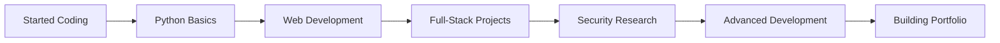

<div align="center">

<!-- HERO SECTION WITH ANIMATED BANNER -->


<!-- ANIMATED TYPING EFFECT -->
<h1 align="center">
  
  <a href="https://git.io/typing-svg">
    
  </a>
  
</h1>

<!-- ANIMATED TECH SHOWCASE -->
<div align="center">
  
</div>

<!-- PROFESSIONAL TERMINAL DISPLAY -->
```bash
┌─[hussain@developer]─[~/portfolio]
└──╼ $ ./initialize_profile.sh

🚀 Loading Developer Profile...
╔═══════════════════════════════════════════════╗
║  👨‍💻 Developer: Muhammad Hussain Kadiwal      ║
║  🎯 Specialization: Full-Stack Development     ║
║  🐍 Expertise: Python | JavaScript | Java     ║
║  🔥 Focus: Web Apps | Security | Automation   ║
║  📍 Based In: India 🇮🇳                        ║
║  🌐 Status: Available for Opportunities       ║
╚═══════════════════════════════════════════════╝

[✓] Profile initialized successfully!
[✓] Ready to build amazing things! ✨
```

<!-- PROFESSIONAL BADGES -->
<p align="center">
  
  
  
  
</p>

<!-- VISITOR COUNTER & STATS -->
<p align="center">
  
  
  
</p>

</div>

---

##  About Me


### 👋 Who Am I?

**🚀 Welcome to my professional portfolio!** I'm a dedicated Full-Stack Developer with a passion for creating innovative solutions and solving complex problems. My journey in technology is fueled by continuous learning and the drive to build applications that make a difference.

**💡 What Drives Me:**
- **Excellence in Code**: Crafting clean, efficient, and maintainable code
- **Continuous Growth**: Actively learning Python, Internet Programming, and advanced web technologies
- **Problem Solving**: Transforming challenges into elegant solutions
- **Security First**: Building secure applications with best practices

**⚡ Current Focus:**
Developing scalable full-stack applications, mastering Python frameworks, and exploring cybersecurity principles to build robust, secure systems.

**📧 Let's Connect:** [hussainkadiwal100@gmail.com](mailto:hussainkadiwal100@gmail.com)

<br clear="both" />

<details>
<summary><b>🎯 Professional Highlights</b></summary>
<br>

- 🔭 **Currently Working On**: Full-Stack Web Applications & Python Projects
- 🌱 **Learning**: Advanced Python, Internet Programming, Django Framework
- 💼 **Available For**: Freelance Projects, Collaborations, Tech Discussions
- 💬 **Expertise Areas**: Java, Web Development, Cybersecurity, System Design
- ⚡ **Fun Fact**: I can debug complex algorithms for hours, but still need Google Maps to find my way! 😄
- 🎯 **Goal**: Building a strong portfolio of innovative projects and contributing to the tech community

</details>

---

##  Tech Stack & Expertise

<div align="center">

### 💻 Programming Languages

<table align="center">
<tr>
<td align="center" width="130">

<br><strong>Python</strong>
<br><sub>Advanced</sub>
</td>
<td align="center" width="130">

<br><strong>Java</strong>
<br><sub>Proficient</sub>
</td>
<td align="center" width="130">

<br><strong>JavaScript</strong>
<br><sub>Proficient</sub>
</td>
<td align="center" width="130">

<br><strong>C/C++</strong>
<br><sub>Intermediate</sub>
</td>
<td align="center" width="130">

<br><strong>Rust</strong>
<br><sub>Learning</sub>
</td>
</tr>
</table>

### 🌐 Web Development Stack

<table>
<tr>
<td align="center" width="110">

<br><strong>HTML5</strong>
</td>
<td align="center" width="110">

<br><strong>CSS3</strong>
</td>
<td align="center" width="110">

<br><strong>React</strong>
</td>
<td align="center" width="110">

<br><strong>Node.js</strong>
</td>
<td align="center" width="110">

<br><strong>Django</strong>
</td>
<td align="center" width="110">

<br><strong>Express</strong>
</td>
</tr>
</table>

### 🛠️ Tools & Technologies

<table>
<tr>
<td align="center" width="110">

<br><strong>Git</strong>
</td>
<td align="center" width="110">

<br><strong>Docker</strong>
</td>
<td align="center" width="110">

<br><strong>Linux</strong>
</td>
<td align="center" width="110">

<br><strong>MySQL</strong>
</td>
<td align="center" width="110">

<br><strong>MongoDB</strong>
</td>
<td align="center" width="110">

<br><strong>PostgreSQL</strong>
</td>
</tr>
<tr>
<td align="center" width="110">

<br><strong>AWS</strong>
</td>
<td align="center" width="110">

<br><strong>VS Code</strong>
</td>
<td align="center" width="110">

<br><strong>Postman</strong>
</td>
<td align="center" width="110">

<br><strong>Redis</strong>
</td>
<td align="center" width="110">

<br><strong>Nginx</strong>
</td>
<td align="center" width="110">

<br><strong>Figma</strong>
</td>
</tr>
</table>

### 🔐 Security & Specializations

<p align="center">


</p>

</div>

---

##  GitHub Analytics & Performance

<div align="center">

### 📊 Performance Dashboard


### 💻 Language Distribution & Activity


### 🏆 GitHub Achievements

<p align="center">
  
</p>

### 🐍 Coding Activity Snake

<p align="center">
  
</p>

### ⚡ Weekly Development Breakdown

<div align="center">

<table>
<tr>
<td align="center" width="25%">
  
**💻 Coding**
<br>
<strong>40%</strong>
<br>
<sub>Active Development</sub>

</td>
<td align="center" width="25%">

**📚 Learning**
<br>
<strong>30%</strong>
<br>
<sub>New Technologies</sub>

</td>
<td align="center" width="25%">

**🔍 Research**
<br>
<strong>20%</strong>
<br>
<sub>Security & Best Practices</sub>

</td>
<td align="center" width="25%">

**📝 Documentation**
<br>
<strong>10%</strong>
<br>
<sub>Code & Project Docs</sub>

</td>
</tr>
</table>

</div>

</div>

---

## 💪 Skills & Proficiency

<div align="center">

### 📊 Technical Skills Overview

```python
skills = {
    "Languages": {
        "Python": "⭐⭐⭐⭐⭐ Advanced",
        "JavaScript": "⭐⭐⭐⭐ Proficient", 
        "Java": "⭐⭐⭐⭐ Proficient",
        "C/C++": "⭐⭐⭐ Intermediate",
        "Rust": "⭐⭐ Learning"
    },
    "Web Development": {
        "Frontend": "React, HTML5, CSS3, JavaScript",
        "Backend": "Node.js, Django, Express.js",
        "Database": "MySQL, MongoDB, PostgreSQL"
    },
    "Tools & DevOps": {
        "Version Control": "Git, GitHub",
        "Containerization": "Docker",
        "Cloud": "AWS (Learning)",
        "Testing": "Postman, Unit Testing"
    },
    "Security": {
        "Ethical Hacking": "Kali Linux, Penetration Testing",
        "Network Security": "Security Protocols, Vulnerability Assessment"
    }
}
```

### 🎯 Skill Progress Bars

<table>
<tr>
<td>
  
**Programming Languages**
- Python: ████████████░░░░░░░░ 85%
- JavaScript: ██████████░░░░░░░░░░ 75%
- Java: ██████████░░░░░░░░░░ 75%
- C/C++: ████████░░░░░░░░░░░░ 60%
- Rust: ████░░░░░░░░░░░░░░░░ 30%

</td>
<td>

**Web Technologies**
- React: ██████████░░░░░░░░░░ 75%
- Node.js: ██████████░░░░░░░░░░ 75%
- Django: ████████░░░░░░░░░░░░ 65%
- HTML/CSS: ████████████░░░░░░░░ 90%
- Express: ████████░░░░░░░░░░░░ 65%

</td>
</tr>
<tr>
<td>

**Tools & Platforms**
- Git/GitHub: ████████████░░░░░░░░ 90%
- Docker: ████████░░░░░░░░░░░░ 60%
- Linux: ██████████░░░░░░░░░░ 75%
- VS Code: ████████████░░░░░░░░ 90%

</td>
<td>

**Databases**
- MySQL: ██████████░░░░░░░░░░ 75%
- MongoDB: ████████░░░░░░░░░░░░ 65%
- PostgreSQL: ██████░░░░░░░░░░░░░░ 50%

</td>
</tr>
</table>

</div>

---

## 🔥 Currently Working On

<div align="center">

### 💼 Active Projects

<table>
<tr>
<td align="center" width="50%">
  
**🌐 Full-Stack Web Application**
- Building a modern web app with React & Django
- Implementing RESTful APIs
- Database design & optimization
- User authentication & security

</td>
<td align="center" width="50%">

**🐍 Python Automation Suite**
- Creating automation scripts
- Web scraping & data processing
- API integrations
- Task automation tools

</td>
</tr>
<tr>
<td align="center" width="50%">

**🔐 Security Research Project**
- Exploring penetration testing
- Network security analysis
- Vulnerability assessment
- Ethical hacking practices

</td>
<td align="center" width="50%">

**📚 Learning & Development**
- Advanced Python concepts
- Internet Programming
- System Design patterns
- Cloud architecture (AWS)

</td>
</tr>
</table>

### 🎯 Project Status

```bash
$ git status

On branch: development
Current Projects:
  ✨ Full-Stack App        [In Progress - 60%]
  ✨ Python Automation     [In Progress - 45%]
  ✨ Security Research     [In Progress - 30%]
  ✨ Learning Projects     [Continuous]

Next Milestone: Launch MVP of Full-Stack App
```

</div>

---

## 🌟 Projects & Portfolio

<div align="center">

### 🚀 What I'm Building

<table>
<tr>
<td align="center" width="33%">

<br><strong>🌐 Full-Stack Web Applications</strong>
<br><em>Modern & Responsive</em>
<br>Building scalable solutions with<br>React, Node.js, and Django
</td>
<td align="center" width="33%">

<br><strong>🐍 Python Automation & Tools</strong>
<br><em>Efficient Solutions</em>
<br>Creating powerful automation<br>scripts and applications
</td>
<td align="center" width="33%">

<br><strong>🔐 Security & Research</strong>
<br><em>Ethical Hacking</em>
<br>Exploring cybersecurity<br>and network security
</td>
</tr>
</table>

### 📦 Featured Repositories

<div align="center">
  
<a href="https://github.com/Kadiwalhussain">
  
</a>

</div>

### 🎯 Project Categories

```python
class ProjectPortfolio:
    def __init__(self):
        self.web_apps = "Full-Stack Applications"
        self.python_projects = "Automation & Scripts"
        self.security_tools = "Cybersecurity Research"
        self.learning_projects = "Skill Development"
    
    def showcase(self):
        return "Building innovative solutions across multiple domains"
    
    def tech_stack(self):
        return {
            "Frontend": ["React", "HTML5", "CSS3", "JavaScript"],
            "Backend": ["Django", "Node.js", "Express"],
            "Languages": ["Python", "JavaScript", "Java"],
            "Database": ["MySQL", "MongoDB", "PostgreSQL"],
            "Tools": ["Git", "Docker", "Postman", "VS Code"]
        }
```

### 📈 Project Statistics

<div align="center">

<table>
<tr>
<td align="center">
  
**📦 Total Projects**
<br>
<strong style="font-size: 24px;">15+</strong>
<br>
<sub>Web Apps, Scripts, Tools</sub>

</td>
<td align="center">

**💻 Lines of Code**
<br>
<strong style="font-size: 24px;">10K+</strong>
<br>
<sub>Across all projects</sub>

</td>
<td align="center">

**🔧 Technologies Used**
<br>
<strong style="font-size: 24px;">20+</strong>
<br>
<sub>Languages & Frameworks</sub>

</td>
<td align="center">

**⏱️ Hours Invested**
<br>
<strong style="font-size: 24px;">500+</strong>
<br>
<sub>Development time</sub>

</td>
</tr>
</table>

</div>

</div>

---

## 🗺️ My Tech Journey

<div align="center">

### 📅 Development Timeline



### 🎓 Learning Path

<table>
<tr>
<td align="center" width="25%">
  
**🌱 Foundation**
- Programming Fundamentals
- Data Structures
- Algorithms
- Problem Solving

</td>
<td align="center" width="25%">

**🌐 Web Development**
- HTML/CSS/JavaScript
- Frontend Frameworks
- Backend Development
- Database Management

</td>
<td align="center" width="25%">

**🔐 Security**
- Ethical Hacking
- Network Security
- Penetration Testing
- Security Best Practices

</td>
<td align="center" width="25%">

**🚀 Advanced**
- System Design
- Cloud Architecture
- DevOps Practices
- Scalable Solutions

</td>
</tr>
</table>

### 💡 Key Milestones

- ✅ **2022**: Started programming journey with Python
- ✅ **2023**: Mastered web development fundamentals
- ✅ **2024**: Built multiple full-stack applications
- 🔄 **2024**: Exploring cybersecurity & advanced Python
- 🎯 **2025**: Planning to launch innovative projects

</div>

---

## 📚 Learning Journey & Goals

<div align="center">

### 🎓 Current Learning Path

<table>
<tr>
<td align="center" width="50%">
<strong>📖 In Progress</strong>
<br>• Advanced Python & Django
<br>• Internet Programming
<br>• System Design Principles
<br>• Cloud Architecture (AWS)
</td>
<td align="center" width="50%">
<strong>🎯 Upcoming</strong>
<br>• Microservices Architecture
<br>• DevOps Practices
<br>• Machine Learning Basics
<br>• Advanced Security Concepts
</td>
</tr>
</table>

### 📈 2024 Goals & Progress

<details>
<summary><b>✅ Completed Milestones</b></summary>
<br>

- ✅ Mastered Python fundamentals and OOP concepts
- ✅ Built multiple full-stack web applications
- ✅ Gained expertise in frontend and backend development
- ✅ Expanded knowledge in cybersecurity and ethical hacking
- ✅ Developed proficiency in multiple programming languages
- ✅ Created a professional GitHub portfolio

</details>

<details>
<summary><b>🚀 Current Focus Areas</b></summary>
<br>

- 🔄 **Advanced Python Development**: Deepening expertise in Django, Flask, and Python best practices
- 🔄 **Internet Programming**: Mastering web protocols, APIs, and network programming
- 🔄 **Portfolio Building**: Creating impressive projects to showcase skills
- 🔄 **Security Research**: Exploring penetration testing and network security
- 🔄 **System Design**: Learning scalable architecture patterns

</details>

<details>
<summary><b>🎯 Future Aspirations</b></summary>
<br>

- 🚀 Launch personal tech blog and share knowledge
- 🚀 Build innovative open-source projects
- 🚀 Participate in hackathons and coding competitions
- 🚀 Mentor aspiring developers
- 🚀 Contribute to meaningful tech projects
- 🚀 Expand professional network in tech community

</details>

</div>

---

## 🛠️ Development Environment

<details>
<summary><b>💻 My Development Setup</b></summary>
<br>

**🖥️ Hardware Configuration:**
- **Primary Machine**: MacBook Pro / High-Performance PC
- **Display**: Dual monitor setup for optimal productivity
- **Peripherals**: Mechanical keyboard, precision mouse, ergonomic workspace

**🔧 Software & Tools:**
- **IDE**: Visual Studio Code with essential extensions
- **Terminal**: iTerm2 (macOS) / Windows Terminal with Oh My Zsh
- **Version Control**: Git with GitHub
- **Browser**: Chrome DevTools for debugging
- **Design**: Figma for UI/UX prototyping
- **API Testing**: Postman for backend development
- **Database Tools**: MySQL Workbench, MongoDB Compass

**⚡ Daily Workflow:**
- **Morning**: ☕ Coffee + Code review + Planning
- **Day**: Active development, learning, building projects
- **Evening**: Project refinement, documentation, networking
- **Night**: Reading tech articles, planning next steps

**🎨 Favorite Extensions:**
- Python, JavaScript, Java language support
- GitLens, Prettier, ESLint
- Docker, Remote Development
- Theme: Tokyo Night / One Dark Pro

</details>

---

## 💭 Coding Philosophy

<div align="center">

### 🎯 My Development Principles

```javascript
const codingPhilosophy = {
  cleanCode: "Write code as if the next developer is a psychopath who knows where you live",
  testing: "If it's not tested, it's broken",
  documentation: "Code tells you how, comments tell you why",
  simplicity: "Simplicity is the ultimate sophistication",
  learning: "The best code is the code you haven't written yet",
  collaboration: "Code is written once, but read many times",
  security: "Security is not a feature, it's a requirement",
  performance: "Premature optimization is the root of all evil... but so is premature pessimization"
};

// Always strive for:
// ✅ Clean, readable, maintainable code
// ✅ Well-documented solutions
// ✅ Secure by default
// ✅ Tested and reliable
// ✅ Scalable architecture
```

### 📝 Favorite Quotes

> *"First, solve the problem. Then, write the code."* - John Johnson

> *"Any fool can write code that a computer can understand. Good programmers write code that humans can understand."* - Martin Fowler

> *"The only way to learn a new programming language is by writing programs in it."* - Dennis Ritchie

</div>

---

## 🎭 Developer Life

<div align="center">

### 🤔 Did You Know?

<table>
<tr>
<td align="center" width="50%">
  
**💻 Coding Habits**
- ☕ Coffee consumed while coding: ∞ cups
- 🐛 Bugs fixed today: Countless
- 💡 "It works on my machine" moments: Too many
- ⏰ Best coding hours: Late night sessions
- 🎵 Coding playlist: Lo-fi beats on repeat

</td>
<td align="center" width="50%">

**🎯 Developer Quirks**
- Can debug for hours but forget where keys are
- Reads code like a novel before bed
- Gets excited about new frameworks
- Loves clean code more than clean room
- Dreams in code sometimes (literally!)

</td>
</tr>
</table>

### 💡 Daily Motivation


### 😄 Developer Humor


### 🎵 Coding Soundtrack

<table>
<tr>
<td align="center" width="33%">

<br><strong>🎵 Lo-fi Hip Hop</strong>
<br>Deep focus sessions
</td>
<td align="center" width="33%">

<br><strong>🎸 Electronic</strong>
<br>High-energy coding
</td>
<td align="center" width="33%">

<br><strong>🎹 Ambient</strong>
<br>Problem-solving mode
</td>
</tr>
</table>

</div>

---

## 🤝 Let's Connect & Collaborate

<div align="center">

### 📬 Professional Links

<p>
<a href="mailto:hussainkadiwal100@gmail.com">
  
</a>
<a href="https://www.linkedin.com/in/muhammad-hussain-kadiwal-6026b9261">
  
</a>
<a href="https://twitter.com/kadiwal_hussain">
  
</a>
<a href="https://credential-dumping.blogspot.com/">
  
</a>
<a href="https://github.com/Kadiwalhussain">
  
</a>
</p>

### 💫 Collaboration Opportunities

```javascript
const professionalProfile = {
  name: "Muhammad Hussain Kadiwal",
  role: "Full-Stack Developer",
  location: "India 🇮🇳",
  interests: [
    "Web Development",
    "Python Projects", 
    "Cybersecurity Research",
    "Innovative Solutions"
  ],
  lookingFor: [
    "Exciting Projects",
    "Learning Opportunities",
    "Tech Collaborations",
    "Mentorship"
  ],
  canHelp: [
    "Code Reviews",
    "Technical Guidance",
    "Project Development",
    "Problem Solving"
  ],
  availability: "Open for Opportunities",
  motto: "Let's build something extraordinary together! 🚀"
};

// Always excited to connect with fellow developers and innovators!
if (you.are.interested && you.want.to.connect) {
  hussain.connect(you);
  console.log("Connection established! Let's create amazing things! ✨");
}
```

### 🌟 What I Bring to the Table

- **Technical Expertise**: Strong foundation in multiple programming languages and frameworks
- **Problem-Solving Skills**: Ability to tackle complex challenges with creative solutions
- **Continuous Learning**: Always staying updated with latest technologies and best practices
- **Collaborative Spirit**: Great team player with excellent communication skills
- **Passion for Excellence**: Committed to writing clean, efficient, and maintainable code

### 📊 Quick Stats

<div align="center">

<table>
<tr>
<td align="center">
  
**⌨️ Lines Written**
<br>
<strong>10,000+</strong>

</td>
<td align="center">

**☕ Coffee Cups**
<br>
<strong>∞</strong>

</td>
<td align="center">

**🐛 Bugs Fixed**
<br>
<strong>Countless</strong>

</td>
<td align="center">

**💡 Ideas Generated**
<br>
<strong>100+</strong>

</td>
<td align="center">

**🌙 Late Night Sessions**
<br>
<strong>Many</strong>

</td>
</tr>
</table>

</div>

</div>

---

<div align="center">

### 🎉 Thank You for Visiting!


**✨ "Code with passion, learn with curiosity, build with purpose!" ✨**

<p>


</p>

*Last updated: December 2024 | Crafted with ❤️ and lots of ☕*

<p align="center">
  
</p>

</div>

---

<!-- Professional Footer -->
<div align="center">

**🌟 "Every line of code is a step towards innovation" 🌟**

*Feel free to reach out for collaborations, opportunities, or just to say hi!*

[](https://github.com/Kadiwalhussain)
[](mailto:hussainkadiwal100@gmail.com)
[](https://www.linkedin.com/in/muhammad-hussain-kadiwal-6026b9261)

</div>

<!-- Easter Egg for curious developers -->
<!-- 
🎉 Congratulations! You found the hidden message! 🎉
If you're reading this, you're probably a fellow developer who appreciates clean code and attention to detail.
Connect with me and mention "Easter Egg" - I'd love to chat about tech, projects, or just have a great conversation! 
Let's build something amazing together! 🚀
-->
